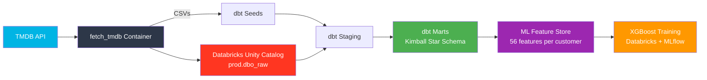

# 🎬 TMDB Churn Prediction Pipeline

An end-to-end data engineering project that ingests content data from the TMDB API, generates realistic synthetic user behavior, transforms it through a Kimball-modeled dbt project on Databricks, and trains an XGBoost churn prediction model — all orchestrated by Apache Airflow.

## Architecture



## Tech Stack

| Layer | Tool | Purpose |
|-------|------|---------|
| **Ingestion** | Python + Docker | Fetch TMDB API data, generate synthetic user behavior |
| **Storage** | Databricks Unity Catalog | Delta Lake tables with governance, lineage, access control |
| **Transformation** | dbt (dbt-databricks) | SQL-based transformation with testing, documentation, and version control |
| **Orchestration** | Apache Airflow + Cosmos | DAG-based scheduling with dbt integration via `astronomer-cosmos` |
| **ML Training** | XGBoost + MLflow | Churn model training with experiment tracking and model registry |

## Project Structure

```
tmdb-churn-prediction/
├── dags/
│   └── churn_pipeline_dag.py        # Airflow DAG: ingest → transform → train
├── scripts/
│   ├── fetch_tmdb.py                # TMDB API ingestion + synthetic data generation
│   ├── Dockerfile                   # Container for the ingestion step
│   └── requirements.txt
├── notebooks/
│   └── train_churn_model.py         # XGBoost training notebook (Databricks)
├── models/
│   ├── staging/                     # 1:1 with sources — clean, cast, dedup
│   │   ├── content/                 #   stg_content_catalog
│   │   ├── customers/               #   stg_users
│   │   ├── watch_events/            #   stg_watch_events
│   │   ├── subscriptions/           #   stg_subscription_events
│   │   ├── support/                 #   stg_support_tickets
│   │   ├── ratings/                 #   stg_user_ratings
│   │   └── watchlist/               #   stg_user_watchlist
│   ├── marts/
│   │   ├── core/                    #   dim_customer, dim_content, dim_date
│   │   ├── churn/                   #   fct_subscription_event, fct_daily_user_activity
│   │   ├── finance/                 #   fct_watch_event, fct_support_interaction
│   │   └── ml/                      #   ml_churn_feature_store (56 features)
│   └── source/                      # _sources.yml definitions
├── seeds/                           # Synthetic CSVs (generated by fetch_tmdb.py)
│   ├── raw_users.csv
│   ├── raw_watch_events.csv
│   ├── raw_subscription_events.csv
│   ├── raw_support_tickets.csv
│   ├── raw_user_ratings.csv
│   └── raw_user_watchlist.csv
├── macros/
│   ├── generate_database_name.sql   # Dev/prod catalog routing
│   └── generate_schema_name.sql     # Schema naming convention
├── docker-compose.yml               # Airflow + Postgres local setup
├── Dockerfile.airflow               # Custom Airflow image with cosmos + dbt
├── dbt_project.yml
├── profiles.yml
└── packages.yml                     # dbt_utils dependency
```

## Pipeline Overview

The Airflow DAG (`churn_pipeline`) runs daily at 02:00 UTC and executes three stages:

### Stage 1 — Ingestion (`DockerOperator`)
A containerized Python script (`fetch_tmdb.py`) that:
- Fetches popular movies and TV shows from the TMDB API
- Generates synthetic user behavior data (watch events, subscriptions, support tickets, ratings, watchlists) using `Faker`
- Writes the content catalog directly to Databricks via `databricks-sql-connector`
- Outputs synthetic CSVs to `seeds/` for dbt to consume

### Stage 2 — Transformation (`DbtTaskGroup` via Cosmos)
`astronomer-cosmos` renders the dbt project as individual Airflow tasks, preserving the `ref()` dependency graph:

```
seeds (raw CSVs)
  └── staging views (clean, cast, dedup)
        └── mart tables (Kimball star schema)
              └── ml_churn_feature_store (56 features per customer)
```

**Key design decisions:**
- **Kimball star schema** — dimensions and facts serve both BI dashboards and ML consumers
- **`generate_surrogate_key`** — consistent hashing across all staging models
- **`generate_database_name` macro** — routes to `dev` or `prod` catalog based on `target.name`

### Stage 3 — ML Training (`DatabricksRunNowOperator`)
Triggers a Databricks Job that runs `train_churn_model.py`:
- Reads from `prod.dbo_marts.ml_churn_feature_store`
- Trains an XGBoost classifier with stratified K-fold cross-validation
- Logs metrics, feature importance, and artifacts to MLflow
- Registers the model in Unity Catalog

## Getting Started

### Prerequisites
- Docker Desktop
- Git
- A Databricks workspace with Unity Catalog enabled
- A TMDB API access token ([get one here](https://www.themoviedb.org/settings/api))

### 1. Clone and configure

```bash
git clone https://github.com/oorucelik/tmdb-churn-prediction.git
cd tmdb-churn-prediction

# Create .env with your credentials
cp .env.example .env
# Edit .env with your TMDB_ACCESS_TOKEN, DATABRICKS_HOST, DATABRICKS_HTTP_PATH, DATABRICKS_TOKEN
```

### 2. Build and start Airflow

```bash
# Build the custom Airflow image
docker compose build

# Initialize the metadata database (first time only)
docker compose up airflow-init

# Start all services
docker compose up -d

# Open the UI: http://localhost:8080 (admin / admin)
```

### 3. Configure Airflow connections

In the Airflow UI → **Admin → Connections**:

| Field | Value |
|-------|-------|
| Connection Id | `databricks_default` |
| Connection Type | `Databricks` |
| Host | `your-workspace.cloud.databricks.com` |
| Extra | `{"token": "your_databricks_token"}` |

### 4. Build the ingestion container

```bash
cd scripts
docker build -t fetch_tmdb:latest .
cd ..
```

### 5. Trigger the pipeline

In the Airflow UI, unpause the `churn_pipeline` DAG and click ▶ Trigger.

## dbt Layer

### Model Layers

| Layer | Materialization | Purpose |
|-------|----------------|---------|
| **Staging** | View | Clean, cast, deduplicate — one model per source |
| **Intermediate** | Ephemeral | Cross-source joins (compiled away, not stored) |
| **Marts** | Table | Business-ready dimensions, facts, and feature store |

### Key Models

| Model | Description |
|-------|-------------|
| `dim_customer` | Customer dimension with demographics, account age, churn status |
| `dim_content` | Content dimension with genres, ratings, popularity |
| `dim_date` | Date dimension for time-series analysis |
| `fct_watch_event` | Viewing activity grain: one row per watch session |
| `fct_subscription_event` | Plan changes, upgrades, downgrades, cancellations |
| `fct_daily_user_activity` | Periodic snapshot fact — daily engagement per customer |
| `ml_churn_feature_store` | 56 features per customer for ML consumption |

### Running dbt locally

```bash
# Install packages
dbt deps

# Run all models
dbt build

# Run tests
dbt test

# Generate and serve docs
dbt docs generate && dbt docs serve
```

## ML Feature Store

The `ml_churn_feature_store` model produces **56 features per customer**, built entirely in SQL:

- **Engagement metrics** — watch frequency, total hours, avg session length, content diversity
- **Subscription signals** — plan tier, days since last change, upgrade/downgrade history
- **Support indicators** — ticket count, avg resolution time, escalation rate
- **Composite scores** — `recency_risk_score`, `support_frustration_score`, `heuristic_churn_risk_score`

> The feature store lives in dbt, not Python. Every feature is tested, documented, version-controlled, and queryable by anyone — not locked in a notebook.

## Environment Variables

| Variable | Description |
|----------|-------------|
| `TMDB_ACCESS_TOKEN` | TMDB API v4 bearer token |
| `DATABRICKS_HOST` | Databricks workspace hostname |
| `DATABRICKS_HTTP_PATH` | SQL Warehouse HTTP path |
| `DATABRICKS_TOKEN` | Databricks personal access token |
| `HOST_PROJECT_PATH` | Absolute host path for Docker bind mounts |
| `AIRFLOW_UID` | Airflow user ID (default: 50000) |

## What I'd Do Differently

- **Sources from day one** — started with seeds for everything, migrated to `source()` later
- **`dbt snapshot` for `dim_customer`** — `is_churned` is a slowly changing attribute that should be SCD Type 2
- **Trunk-based development earlier** — spent time managing `dev/qa/main` branches before converging on short-lived feature branches

## CI/CD

The project uses **dbt Cloud CI jobs** triggered on pull requests:

| Job | Command | Purpose |
|-----|---------|---------|
| **Slim CI** | `dbt build --select state:modified+` | Only builds and tests models changed in the PR (compares against production manifest) |
| **Source Freshness** | `dbt source freshness` | Validates that upstream sources have been updated within the configured window (30-day error threshold) |

Model-level data tests are enforced on every CI run, including:
- `unique` and `not_null` on all surrogate and natural keys
- `accepted_values` on categorical columns (e.g., `content_type`, `current_plan`)
- `not_null` on computed metrics like `daily_engagement_score`

## License

This project is for educational and portfolio purposes.
